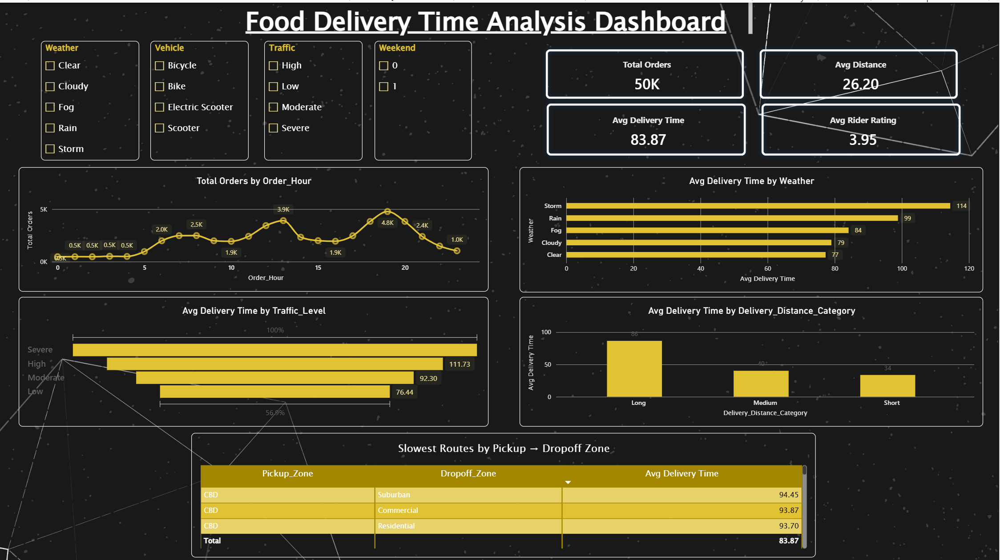

# Food Delivery Time Analysis Dashboard (Power BI)

An interactive Power BI dashboard that analyses what drives food delivery time across **50,000 orders**, looking at weather, traffic, distance, time of day and pickup → dropoff routes.



## Objective

Understand which factors slow down deliveries and where operations can improve, so that delays can be predicted and reduced.

## Dataset

- **Source:** Kaggle – Food Delivery Time Prediction dataset (by dharmendrapandit12)
- **Size:** ~50,000 rows
- **Main table in the model:** `Food_Delivery_Time_Prediction`
- **Key fields:** `Time_taken_min`, `Road_Distance_km`, `Rider_Rating`, `Weather`, `Traffic_Level`, `Vehicle`, `Order_Hour`, `Is_Weekend`, `Delivery_Distance_Category`, `Pickup_Zone`, `Dropoff_Zone`

## Headline Metrics

| Metric | Value |
|---|---|
| Total Orders | 50K |
| Avg Distance | 26.20 km |
| Avg Delivery Time | 83.87 min |
| Avg Rider Rating | 3.95 |

## Key Findings

| Factor | Finding |
|---|---|
| **Weather** | Storm has the longest average delivery time (114 min), followed by Rain (99). Clear weather is the fastest (77), so storms add roughly 48% to delivery time. |
| **Traffic** | Severe traffic averages 134.40 min versus 76.44 min in low traffic, about 76% longer. High (111.73) and Moderate (92.30) fall in between. |
| **Distance** | Long-distance deliveries average 86 min against 34 min for short ones, about 2.5x longer. Medium sits at 40 min. |
| **Order timing** | Orders peak around 7 PM (about 4.8K orders), with a second peak near 1 PM (about 3.9K). Overnight volume is very low (about 0.5K per hour). |
| **Routes** | The slowest routes all start in the CBD: CBD → Suburban (94.45), CBD → Commercial (93.87) and CBD → Residential (93.70). |

## Dashboard Features

- **Slicers:** Weather, Vehicle, Traffic and Weekend, to filter every visual at once
- **KPI cards:** Total Orders, Avg Distance, Avg Delivery Time, Avg Rider Rating
- **Line chart:** Total orders by order hour
- **Bar chart:** Avg delivery time by weather
- **Funnel chart:** Avg delivery time by traffic level
- **Column chart:** Avg delivery time by delivery distance category
- **Table:** Slowest routes by pickup → dropoff zone

## DAX Measures

```dax
Avg Delivery Time = AVERAGE(Food_Delivery_Time_Prediction[Time_taken_min])
```

```dax
Avg Distance = AVERAGE(Food_Delivery_Time_Prediction[Road_Distance_km])
```

```dax
Avg Rider Rating = AVERAGE(Food_Delivery_Time_Prediction[Rider_Rating])
```

```dax
Total Orders = COUNTROWS(Food_Delivery_Time_Prediction)
```

```dax
Weekend Orders Perc = DIVIDE(
    CALCULATE(COUNTROWS(Food_Delivery_Time_Prediction), Food_Delivery_Time_Prediction[Is_Weekend] = 1),
    [Total Orders]
)
```

## Business Insights

- Weather and traffic are the biggest external drivers of delay, so dynamic delivery-time estimates and surge staffing during storms or severe traffic would help.
- CBD-origin routes are consistently the slowest, which makes them a good place to review rider allocation and dispatch.
- Demand peaks at lunch and especially in the evening, so rider capacity should be planned around those hours.

## Tools Used

- Power BI Desktop (data modelling, DAX, visuals)
- DAX for calculated measures

## Repository Structure

```
├── Project.pbix
├── Food_Delivery_Time_Analysis_Report.pptx
├── screenshots/
│   └── dashboard-overview.png
└── README.md
```

## How to Open

1. Download `Project.pbix`.
2. Open it in [Power BI Desktop](https://powerbi.microsoft.com/desktop/) (free).
3. Use the slicers to explore the data.

## Author

**Falha P**
[GitHub](https://github.com/falha8) · [LinkedIn](https://linkedin.com/in/falha-p)
